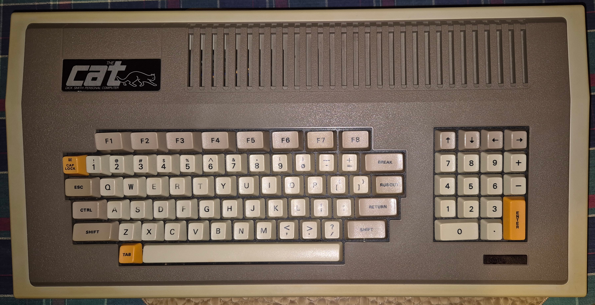

Technical Information for the Dick Smith Cat / Laser 3000
=========================================================

This project was born out of nostalgia for the 6502-based "Dick Smith Cat"
computer that I had back in the 1980's.  It was mostly Apple II compatible;
overseas it was known as the VTech Laser 3000.  See **History** below for more.

Unfortunately the power supply died on mine and I sent it to the dump.
I now really wish I hadn't!  Fortunately, I did find a Cat on Gumtree
for sale in 2024 and so I now have a Cat again, together with some
accessories (joysticks, disk controller, disk drive, and emulator cartridge).

This project is my contribution to preserving Cat history.

## Schematics

The schematics in the original [Technical Reference Manual](https://archive.org/details/dsecattrm)
are very hard to read.  So I decided to redraw them in KiCad.

There are lots of details missing in the Technical Reference Manual;
for example, U17 is listed in the schematic but there is no information
that it is a 74LS86 Quad XOR gate.  It was necessary to figure out
from context what the components were.  I'll cross-check them with the
actual Cat later.

Here are the schematics, redrawn in Kicad:

* [Motherboard Schematic](schematics/Dick_Smith_Cat_Motherboard/PDF/Dick_Smith_Cat_Motherboard.pdf)
* [PAL Linear Board Schematic](schematics/Dick_Smith_Cat_Linear_Board_PAL/PDF/Dick_Smith_Cat_Linear_Board_PAL.pdf)
* [Power Supply Schematic](schematics/Dick_Smith_Cat_Power_Supply/PDF/Dick_Smith_Cat_Power_Supply.pdf)
* [Emulator Cartridge Schematic](schematics/Dick_Smith_Cat_Emulator/PDF/Dick_Smith_Cat_Emulator.pdf)
* [Joystick Schematic](schematics/Dick_Smith_Cat_Joysticks/PDF/Dick_Smith_Cat_Joysticks.pdf)

## Kernel ROM Listing

I have typed up the kernel ROM listing from the Technical Reference Manual,
and annotated it with my own notes as to what is happening.  The source
code can be found in the [src/kernel](src/kernel) directory.

## Memory Map

The Cat supports an 18-bit 256K memory address space, divided up into
sixteen 16K memory banks.  Any of these sixteen memory banks can be
mapped into four memory "windows" at addresses $0000, $4000, $8000, and
$C000.  By default the ROM maps memory banks 0, 1, 3, and F into the
four memory windows.

* $00000 to $0FFFF - 64K of RAM on the motherboard.
* $10000 to $2FFFF - 128K of expansion RAM (not fitted as standard).
* $30000 to $37FFF - Unused space.
* $38000 to $3BFFF - BASIC ROM.
* $3C000 to $3CFFF - I/O space.
* $3D000 to $3FFFF - BASIC and kernel monitor ROM.

The memory windows are set by writing the memory bank number (0-F) to the
I/O addresses $3C07C, $3C07D, $3C07E, and $3C07F.  The memory bank numbers
should also be written to zero page locations $C5, $C6, $C7, and $C8
so that the rest of the system knows the current memory arrangement.

Note: Writing a value other than F to $3C07F will make the system unusable
as the I/O space will become inaccessible in the 6502's 64K address space.
There is no way to restore the correct mapping except via a system reset.

## Slots

The Cat does not have physical slots in the same sense as the Apple II.
The 72-pin expansion connectors have the entire 256K 18-bit address bus and
8-bit data bus available.  Decoding of slot addresses is done on the plug-in
cartridges.  The I/O "slots" are virtual and are allocated as follows:

* Slot 0 - Emulator cartridge a.k.a the language card
* Slot 1 - Printer
* Slot 2 - RS-232
* Slot 3 - 80 column mode
* Slot 4 - Unused
* Slot 5 - Reserved for a second disk controller
* Slot 6 - Standard disk controller
* Slot 7 - Unused

At startup, the monitor ROM will probe for a disk controller in slot 6
and then the ROM will probe for a disk controller in slot 5.  If either
slot is occupied, the ROM jumps to the disk controller's ROM to boot
from the external disk drive.

Cat's didn't use slot 5 - the disk controller was always in slot 6.

Slot 5 could be used to create a bootable game or program cartridge.
Instead of booting a disk, the program in the cartridge is run
automatically at power on if there is no disk constroller cartridge
present.  The following hexadecimal bytes should appear at $C500 to
make the cartridge auto-boot:

    A2 20 A0 00 A2 03 86 3C

These signature bytes are followed by code to load the cartridge's ROM
contents into main RAM to run the program.  Or bank-switch in the
cartridge at address $4000 or $8000 to execute directly out of the ROM.

If a disk controller cartridge is present in slot 6, then slot 5 will not
boot automatically.  Use <tt>PR#5</tt> at the BASIC prompt to activate the
code in the slot 5 cartridge.

## New Projects

* [ROM cartridge for the RS-232 interface](ROMCart.md)

## Can We Rebuild It?

Since Cats (and Laser 3000's) are so rare these days, there is a question as
to whether we could build a replica using modern off-the-shelf parts.

Well, no.

The core of the Cat is two 64-pin gate array chips, U2 and U14.  These
handle glue logic, dynamic RAM interfacing, and the video subsystem.
Without a working Cat to harvest the chips from, there's no way to replicate it.
And if I have a working Cat, I don't need to replicate it!

The gate arrays and clean-roomed ROM's is how VTech avoided Apple's lawyers.
It wasn't a chip for chip rip-off of the Apple II like many other clones
back in the day.

In theory a new circuit could be built using the equivalent in TTL logic
chips, but then you'd end up with a straight Apple II clone.  There are
plenty of designs online for that, including the original Apple II schematics.

The other possibility is to use a modern FPGA to replicate the original
gate arrays on 64-pin carrier boards.  That would be useful for repairing
actual Cats, but would be a lot of work.

Another problem for replication is the ROM's.  The assembly code for the
kernel monitor ROM is in the Technical Reference Manual.  I have put the
code in the [src/kernel](src/kernel) sub-directory of this repository,
annotated with some of my own notes to explain what is going on.

I wasn't been able to find the BASIC ROM's online anywhere.  I had bits and
pieces of the BASIC ROM's that I disassembled by hand back in the day,
but not a complete set.  Now that I have a working Cat, I will dump the
ROM's at some point.

## Chip List

As mentioned above, the schematics in the Technical Reference Manual do not
include information as to what part each "Un" designator corresponds to.
Most of them I was able to figure out from context and the rest were
confirmed through inspection of an actual Cat motherboard.

<table border="1">
<tr><td><b>Designator</b></td><td><b>Part</b></td><td><b>Schematic Pages</b></td></tr>
<tr><td>U1</td><td>555 Timer</td><td>2</td></tr>
<tr><td>U2</td><td>Gate Array 2</td><td>4</td></tr>
<tr><td>U3</td><td>74LS04 Hex Inverter</td><td>4</td></tr>
<tr><td>U4</td><td>74LS04 Hex Inverter</td><td>2, 4, 7</td></tr>
<tr><td>U5</td><td>4164 64-kbit Dynamic RAM</td><td>5</td></tr>
<tr><td>U6</td><td>4164 64-kbit Dynamic RAM</td><td>5</td></tr>
<tr><td>U7</td><td>4164 64-kbit Dynamic RAM</td><td>5</td></tr>
<tr><td>U8</td><td>4164 64-kbit Dynamic RAM</td><td>5</td></tr>
<tr><td>U9</td><td>4164 64-kbit Dynamic RAM</td><td>5</td></tr>
<tr><td>U10</td><td>4164 64-kbit Dynamic RAM</td><td>5</td></tr>
<tr><td>U11</td><td>4164 64-kbit Dynamic RAM</td><td>5</td></tr>
<tr><td>U12</td><td>4164 64-kbit Dynamic RAM</td><td>5</td></tr>
<tr><td>U13</td><td>74LS174 Hex D-Type Flip-Flop (some boards fit a 74LS244 instead for U13)</td><td>4</td></tr>
<tr><td>U14</td><td>Gate Array 1</td><td>4</td></tr>
<tr><td>U15</td><td>74LS139 Dual 2-Line to 4-Line Decoder</td><td>5, 6</td></tr>
<tr><td>U16</td><td>74LS138 3-Line to 8-Line Decoder</td><td>6</td></tr>
<tr><td>U17</td><td>74LS86 Quad XOR Gate</td><td>2</td></tr>
<tr><td>U18</td><td>74LS74 Dual D Flip-Flop</td><td>7</td></tr>
<tr><td>U19</td><td>74LS125 Quad Buffer with Tri-State Outputs</td><td>2, 3, 7</td></tr>
<tr><td>U20</td><td>74LS08 Quad AND Gate</td><td>5, 7</td></tr>
<tr><td>U21</td><td>74LS163 Binary 4-bit Counter</td><td>2</td></tr>
<tr><td>U22</td><td>2732 EPROM (Character Generator)</td><td>7</td></tr>
<tr><td>U23</td><td>74LS166 Shift Register</td><td>7</td></tr>
<tr><td>U24</td><td>74LS244 Octal Buffer</td><td>3</td></tr>
<tr><td>U25</td><td>74LS244 Octal Buffer</td><td>3</td></tr>
<tr><td>U26</td><td>74LS244 Octal Buffer</td><td>3</td></tr>
<tr><td>U27</td><td>6502A CPU</td><td>3</td></tr>
<tr><td>U28</td><td>Not used in the schematic (some boards fit a 74LS04 for U28)</td><td> </td></tr>
<tr><td>U29</td><td>74LS74 Dual D Flip-Flop</td><td>7</td></tr>
<tr><td>U30</td><td>74LS00 Quad NAND Gate</td><td>7</td></tr>
<tr><td>U31</td><td>74LS74 Dual D Flip-Flop</td><td>2</td></tr>
<tr><td>U32</td><td>74LS374 Octal D-Type Latch, Edge Triggered</td><td>7</td></tr>
<tr><td>U33</td><td>74LS373 Octal D-Type Latch, Transparent</td><td>9</td></tr>
<tr><td>U34</td><td>74LS08 Quad AND Gate</td><td>2, 6, 10</td></tr>
<tr><td>U35</td><td>74LS00 Quad NAND Gate</td><td>3, 7</td></tr>
<tr><td>U36</td><td>74LS04 Hex Inverter</td><td>2, 3, 6, 7</td></tr>
<tr><td>U37</td><td>74LS145 BCD to decimal decoder, open collector</td><td>8</td></tr>
<tr><td>U38</td><td>27256 28-pin ROM</td><td>6</td></tr>
<tr><td>U39</td><td>74LS374 Octal D-Type Latch, Edge Triggered</td><td>10</td></tr>
<tr><td>U40</td><td>74LS245 Bus Transceiver</td><td>3</td></tr>
<tr><td>U41</td><td>74LS244 Octal Buffer</td><td>8</td></tr>
<tr><td>U42</td><td>SN76489AN Sound Generator</td><td>10</td></tr>
<tr><td>U43</td><td>74LS138 3-Line to 8-Line Decoder</td><td>10</td></tr>
<tr><td>U44</td><td>8048 Keyboard Microcontroller</td><td>8</td></tr>
<tr><td>U45</td><td>74LS251 8-Line to 1-Line Selector/Muliplexer</td><td>10</td></tr>
<tr><td>U46</td><td>558 Quad Timer</td><td>10</td></tr>
<tr><td> </td><td> </td><td> </td></tr>
<tr><td>U47</td><td>74LS00 Quad NAND Gate</td><td>Linear Board 1</td></tr>
<tr><td>U48</td><td>TEA 1002 PAL Encoder</td><td>Linear Board 1</td></tr>
<tr><td>U49</td><td>uA741C Amplifier</td><td>Linear Board 2</td></tr>
<tr><td>U50</td><td>TBA820M Amplifier</td><td>Linear Board 3</td></tr>
</table>

## References

* [Cat Technical Reference Manual on archive.org](https://archive.org/details/dsecattrm)
* [Laser 3000 Personal Computer User's Manual on archive.org](https://archive.org/details/l3000UM)
* [Laser 3000 Personal Computer BASIC Reference Manual on archive.org](https://archive.org/details/Laser3000PersonalComputerBASICReferenceManualAppleIIClone)
* [Dick Smith Cat on Reddit](https://www.reddit.com/r/retrobattlestations/comments/tohbjp/team_green_dick_smith_cat_aka_vtech_laser_3000/)
* [Dick Smith Cat on AppleLogic](http://www.applelogic.org/TheCAT.html)
* [Laser 3000 on OLD-COMPUTERS.COM](https://www.old-computers.com/museum/computer.asp?c=156)

## History

The Dick Smith Cat was the first computer that my family owned.  My parents
paid AUD$699 for it in 1984 when I would have been about 14 years old.
The receipt was still stapled into the back of one of the manuals!
The family's black and white spare holiday TV served as the monitor.
Later a printer and a disk drive were added.

Overseas, the Cat was known as the VTech Laser 3000.  Dick Smith Electronics
rebadged it as the "Cat" in Australia.  It was mostly Apple II compatible
but about half the price that an Apple II was at the time.

The power supply died around 1988 or 1989 and it never recovered.
I sent it to the electronics recyclers a long time ago, and now I
wish I hadn't.  Knowing what I do now, it may have been possible to
restore it.

Back in the day I quickly discovered that the ROM listings only
contained a tiny fraction of all of the ROM's in the system.
But that didn't stop me!  I disassembled a lot of the original ROM's by
hand on paper while still in high school.  And I still have my hand-written
notes up in the cupboard!

The original process of disassembly was made more difficult because the
Cat's kernel monitor did not have a disassembler like the Apple II did.
I had to memorise the entire 6502 instruction set and decode the
hexadecimal by hand.

My hand-written notes are incomplete but I do have a large chunk of the
original BASIC ROM's in my notes.

## License

Schematics for Dick Smith Cat by Rhys Weatherley is licensed under <a href="http://creativecommons.org/licenses/by-nc-sa/4.0/?ref=chooser-v1" target="_blank" rel="license noopener noreferrer" style="display:inline-block;">Attribution-NonCommercial-ShareAlike 4.0 International</a>

## Contact

For more information on this code, to report bugs, or to suggest
improvements, please contact the author Rhys Weatherley via
[email](mailto:rhys.weatherley@gmail.com).
