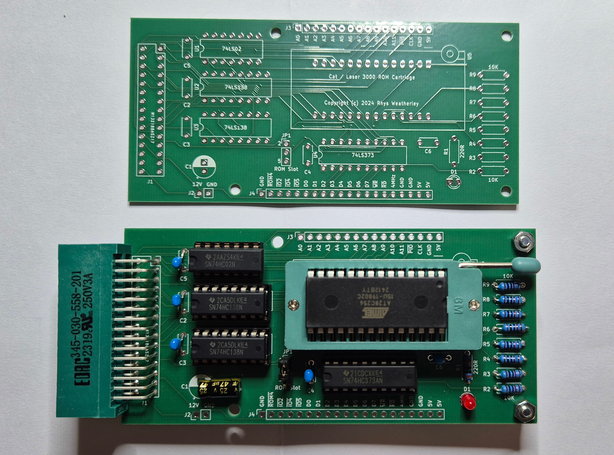
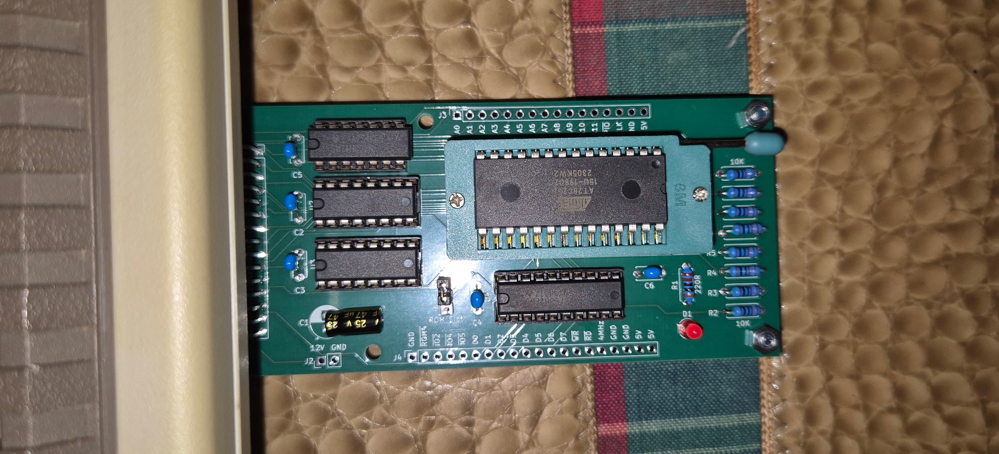
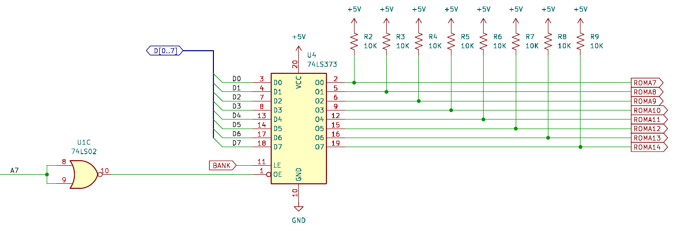

ROM Cartridge for the RS-232 interface
======================================

This page describes the design of my "ROM Cartridge" that plugs into the
RS-232 interface on the back of the Cat.

The Cat I bought off Gumtree did not have a working disk controller,
so it was hard to get programs and data onto and off of the Cat.

Because I wanted some way to load programs, I came up with a design for a
32K ROM cartridge that could plug into the 30-pin RS-232 interface.
It is possible to plug into the 72-pin expansion interfaces on the side or
the back of the case, but the RS-232 interface is simpler.

Here is the bare PCB and the made-up version of the PCB:

And here it is plugged into the "RS-232 Interface" on the back of the Cat:

I added some stand-offs in the two PCB mounting holes on the right to
prevent the PCB putting mechanical strain on the motherboard as the
EEPROM was removed and re-inserted.

## Design details

The PDF of the schematic can be found [here](schematics/Cat_ROM_Cartridge/PDF/Cat_ROM_Cartridge.pdf).

The 30-pin RS-232 interface on the Cat provides 12 address lines A0 to A11,
plus the PIOSEL address
selection line for $C000 to $CFFF.  This memory space is used by all
I/O ports and associated slot ROM's so we have a very limited space
to work with.

There is a jumper on the cartridge PCB to select either slot 2 or slot 5.
When the jumper selects slot 2, the ROM appears at the addresses
$C200 to $C2FF.  When the jumper selects slot 5, the ROM appears at the
addresses $C500 to $C5FF.  For the examples below, we will assume the
ROM is in slot 2 at $C200.

This only gives 256 bytes to work with out of the 32K ROM.  So how can
we access the rest?  The trick is the 74LS373 latch U4:

When A7 is low, the output of the latch is disabled and the 10K pull-up
resistors set the upper ROM address lines to all-1's.  This causes
requests for $C200 to $C27F to come from the top-most 128 bytes in the
32K EEPROM.

When A7 is high, the output of the latch is enabled, and the contents of the
latch selects which 128-byte page to access.

To select which page to access at runtime, the program writes the page
number (0 to 255) into address $C200 (or $C500).  Thus, the entire
32K EEPROM can be accessed 128 bytes at a time.

The normal use case is to put a 128-byte loader program into the top-most
128 bytes of the EEPROM.  The loader selects the other pages one at a
time and copies their contents down to RAM.  Then the program in the
EEPROM can be executed out of RAM.  The EEPROM is almost like a little
disk drive with 128-byte sectors.

There are other ways I could have hooked things up.  Each slot in the
Apple II / Cat architecture can have an extra 2K ROM at $C800, but it is
complex to co-ordinate with other slots to swap that ROM in and out.
A lot of TTL logic is needed.  The "little disk drive" method is simpler
and requires less TTL logic.

## Auto-booting

Slot 5 is special in the Cat's kernel monitor.  At power on, the kernel
monitor first looks for a floppy disk drive controller at address $C600.
If it doesn't find one, it will look at address $C500 for the following
magic bytes:

    A2 20 A0 00 A2 03 86 3C

If these bytes are found, then it will jump to $C500 and auto-boot off the
"second disk controller".  Any program you put into the cartidge ROM
in slot 5 will run automatically at power on!  Easy!

## Example programs

### Hello

The binary image `src/rom-cartridge/hello.bin` is a simple Hello World example.
Flash it into a 32K AT28C256 EEPROM and insert it into the cartridge's
ROM socket.

Insert the cartridge with the machine turned off.  Then turn the machine on,
type `CALL -151` to enter the kernel monitor, and then type `C200G` to run
the example.  This assumes you have the jumper set to slot 2.  If the
jumper is set to slot 5, then type `C500G` instead.

The example will clear the screen, print "Hello, World!" and the address
that the ROM image was loaded from.

Another method to activate the "Hello, World!" program is to execute
`PR#2` or `PR#5` at the BASIC prompt.

The `hello.bin` image also has different values in each of the 128-byte
memory banks.  You can inspect them using the kernel monitor:

    *C200:55<ENTER>
    *C280<ENTER>
    C280= 55
    *C200:AE<ENTER>
    *C280<ENTER>
    C280= AE

The value you write to $C200 selects the memory bank.  When you read
from $C280, you should get back the bank number.  The only exception
is bank $FF which contains the Hello World code.

### Loader

The code in `src/rom-cartridge/loader.s` provides a 124-byte program
loader that resides in the lower 128 bytes of the $C200 (or $C500) ROM space.
This must be positioned at offset $7F80 in the 32K EEPROM.  The bytes at
addresses $7FFC to $7FFF contain the following:

* Two-byte address to load the primary boot program to (low byte first).
* The size of the primary boot program in bytes, minus 1 (low byte first).

The "primary boot program" resides at offset $0000 in the 32K EEPROM.
The loader copies the program to RAM and then jumps to it.  This makes the
loader the equivalent of a disk's boot sector, and the "primary boot program"
equivalent to a disk operating system.  The "disk" is 32K in size and
each sector is 128 bytes in length.

When the loader jumps to the primary boot program, the byte at $047A
in RAM will be set to either $C2 or $C5 depending upon which slot the
EEPROM resides in.  This can help the primary boot program load
additional code and data from the EEPROM into RAM.

The Python script `src/rom-cartridge/build-rom.py` can be used to
combine a program image with the loader to build a complete 32K image to
burn into the EEPROM:

    python3 build-rom.py output.bin ???? program.bin loader.bin

where `????` is the hexadecimal address to load `program.bin` to in RAM.
Unused regions are padded with $FF bytes.

### Hello2

The binary image `src/rom-cartridge/hello2.bin` is similar to the first
hello example.  It uses the loader to copy the example code to $0300
in RAM and then runs the example from there.

## Expansion capabilities

The address, data, control, and power lines are exposed on two
pin headers along the edges of the board.  Daughter boards can be
attached to provide expansion capabilities, such as:

* An actual RS-232 serial interface.
* General purpose I/O using a 65C22 Versatile Interface Adapter (VIA).
* SD card interface.

## Making your own!

The Gerber files are included in the repository
[here](schematics/Cat_ROM_Cartridge/Gerbers).  You will also need a
32-pin edge connector.  I acquired a EDAC 345-030-558-201 from Mouser.
The Mouser part number is 587-345-030-558-201.

At the time of writing, I have a few spare PCB's and edge connectors.
Contact me via e-mail and I'll mail one to you if I still have spares.
You'll have to source the other components yourself.

Here is the complete parts list:

* 1 x 74LS02 or 74HC02 quad NOR gate.
* 2 x 74LS138 or 74HC138 3-line to 8-line decoder/demultiplexer.
* 1 x 74LS373 or 74HC373 octal latch.
* 1 x AT28C256 32K EEPROM.
* 5 x 100nF ceramic or monolithic capacitor.
* 1 x 47uF electrolytic capacitor rated for 15V or better.
* 8 x 10K resistor, 1/4W or better.
* 1 x 220 ohm resistor, 1/4W or better.
* 1 x 3mm LED.
* 3-pin 2.54mm terminal header plus jumper.
* 30-pin edge connector.
* PCB for the Cat ROM Cartridge.

Sockets:

* 1 x 14-pin socket.
* 2 x 16-pin socket.
* 1 x 20-pin socket.
* 1 x 28-pin socket - either a regular socket or a ZIF socket.

It is recommended that the EEPROM be in a socket for easy re-programming,
but the 74xx series TTL logic chips can be soldered directly to the board.
